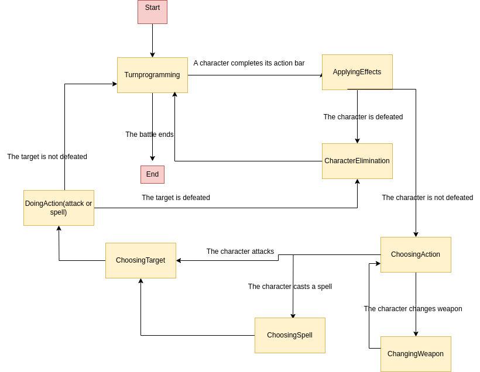

# Final Reality

Final Reality is a simplified clone of the renowned game, Final Fantasy. Its main purpose is to
serve as an educational tool, teaching foundational programming concepts.

This README is yours to complete it. Take this opportunity to describe your contributions, the
design decisions you've made, and any other information you deem necessary.

This project is licensed under the
[Creative Commons Attribution 4.0 International License](https://creativecommons.org/licenses/by/4.0/).

## Traits

The following files in the source code correspond to traits:

* Weapon.scala
* MagicWeapon.scala
* TCharacter.scala
* WCharacter.scala
* MagicalCharacter.scala
* TParty.scala
* TProgrammer.scala
* TEnemy.scala
* Spell.scala
* GameState.scala

Traits don't contain values nor variables. Instead, getters are put to be implemented by their correponding classes.

## Classes design

### Character

Characters are the fighters in combats. There are different types of characters: common, magical and enemies. The player controls common and magical characters. Common and magical characters contain an equiped weapon (if applicable), name, health points, defense, weight and a list of weapons they can use. Enemies are considered characters (this avoids code duplication): they are different because they can not wear weapons, but in the program they have an auxiliary weapon with a default attack.

Characters have minimum value requirements. In the constructor of the corresponding class the object Require is used to check if the minimum value requirements are met. If they don't, an InvalidStatException is thrown.

#### Enemy

An enemy is a special type of character who can not carry weapons and it has a default attack value.

#### Magical Characters

Magical characters also have mana points.

### Party

Each party is composed of zero or more characters. At the beginning of each turn the program checks whether both the player party and the enemy party have at least one living characters. If it is not the case, the combat ends. Else, the combat continues.

A party is modeled using a class with:
* A list of characters
* A method for knowing if the party is defeated or not

### Weapon

A weapon can be carried by a common or magical character. It contains a name, attack, a weight and an owner. There are three types of weapons: common, magical, and auxiliaries (for enemies). Magical weapons also contain a magic attack.

Weapons have minimum value requirements. In the constructor of the corresponding class the object Require is used to check if the minimum value requirements are met. If they don't, an InvalidStatException is thrown.

#### Magic Weapons

Magic Weapons also have magic attack points, useful for making damage with spells.

### Spell

Each spell has its own class, that extends from an abstract spell class which contains some generic methods for executing spells. It makes it easier to add new spells.

For now, spells can only consume the user's mana and augment or reduce the target's number of health points.

### Turn scheduler

The turn scheduler is implemented in the Assigner class, which extends the Programmer Trait.

### Controller

A game is controlled by the game controller implementing the State Design Pattern. The game controller contains the turn programmer of the game and a variable with the current state of the game.

#### States

Each phase of the game is modelled using states. Each time an event happens, its "update" method is called for the game controller to change its state if necessary.

#### States Diagram

## Weapon compatiblity

Each type of character can only wear certain kinds of weapons. The type of weapon each type of characters can carry appears in the project statement. Weapon compatiblity is implemented using the double dispatch technique: for each character, there is a function in the trait Weapon to be implemented in the definition of each weapon class.

## Exceptions

See each exception file for more details.

### InvalidStatException

This exception is thrown when a game statistic is not valid. For instance, when initializing a new character its initial hp is negative.

### IncompatibleWeaponException

This exception is thrown when a weapon is assigned to a character who is not compatible. See "Weapon compatiblity" for more details.

### SameTypeException

This exception is thrown when a character attacks another character or an enemy attacks another enemy.

### PartyLimitException

This exception is thrown when trying to add a character to a party that already reached the limit number of characters.

### DoubleEquipmentException

This exception is thrown when trying to equip a weapon already equipped to another character.

### InvalidUserException

### InvalidTargetException

### InsufficientManaException

### NoMagicWeaponException

## Tests

Tests for the AbstractWCharacter class are in the NinjaTest class. Tests for the AbstractWeapon class are in the AxeTest class.
